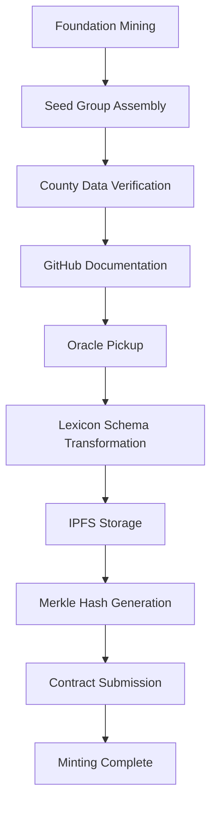

# Test Evaluator Agent

An AI-powered data extraction evaluator agent using LangGraph for property data processing.

## Features

- Multi-agent conversation system for data extraction validation
- Schema validation using JSON Schema
- CLI validation integration
- Address matching with fuzzy logic
- Retry mechanism with configurable limits
- IPFS schema fetching and caching

## Installation

You can run this tool directly using `uvx`:

```bash
uvx --from git+https://github.com/elephant-xyz/AI-Agent test-evaluator-agent
```

## Usage

The agent requires specific directory structure and environment variables:


### pre-requisites
```
./possible_addresses/ directory should contain all possible addresses for each property has its own json file with all possible addresses from OpenAddress.
./seed.csv  # Seed CSV file for initial data
./input/  # properties input file to be processed, either json or html format
./upload-results.csv # csv generated from Minting Seed data group, it contains all the Property CIDs.

```

### Agent output directory structure
```
./schemas/        # JSON schemas for validation
./data/          # Intermediate extracted data
./scripts/       # all scripts that are generated by AI-Agent
./submit/        # containes the final output that will be submitted to the CLI Validator
```

### Environment Variables
- `MODEL_NAME`: AI model to use (default: gpt-4.1)
- `TEMPERATURE`: Model temperature (default: 0)

### Running the Agent

```bash
# Set environment variables
export MODEL_NAME=gpt-4.1
export TEMPERATURE=0
export OPENAI_API_KEY=your_openai_api_key_here

# Run the agent
test-evaluator-agent
```

## How It Works

1. **Owner Extraction Phase**: The agent generates extraction scripts based on input files and schemas and analyze the owner data to determine whether it is a valid person or company.
2. **Address Matching Phase**: Generator matches addresses with candidates, CLI Validator checks final output
3. **Utility/Structer/layout extraction Phase** Generator extract utility, structure and layout information.
4 **Data Extraction and validation Phase**: Generator creates extraction scripts, Schema and Data Evaluators validate output


## Development

This package is designed to be run as a standalone tool with all dependencies managed automatically.

## NOTE: in case of running the generated scripts by AI agent directly without using the AI agent, you need to run prepare_to_submit.py script to build relationships and have data ready for submission

# Seeding Process

## Overview

The seeding process is a multi-stage workflow that transforms property data into blockchain-verified assets through a structured approach involving  mining and minting steps.

## Seed Group Architecture

### Core Components

The **Seed Group** serves as the foundational structure consisting of four essential classes:

#### 1. Group Object
- Acts as the root of the Merkle document
- Provides the top-level container for all related data
- Gets hashed and referenced in the smart contract
- Forms the Merkle root for data integrity verification

#### 2. Relationship
- Defines connections and links between objects
- Establishes data relationships within the Seed Group
- Enables proper data association and referencing

#### 3. Property Seed
- Contains information needed to retrieve property details
- Interfaces with county systems via HTTP requests
- Uses parcel ID for property identification
- Enables access to official county records

#### 4. Unnormalized Address
- Raw address input as provided by data sources
- May not be normalized or geocoded initially
- Identifies property location for mapping services
- Compatible with services like Google Maps for location verification

## Mining Process

### Foundation Responsibilities

**Mining** refers to the process of assembling a complete Seed Group:

- **Data Collection**: Gathering property-related information from various sources
- **Initial Processing**: Structuring raw data into the Seed Group format
- **Verification**: Linking county-certified information
- **Documentation**: Publishing certified county links on GitHub
- **Quality Assurance**: Ensuring data accuracy before Oracle handoff

### Mining Outputs
- Structured Seed Group ready for Oracle processing
- Verified county data links
- GitHub-hosted certification documentation

## Oracle Workflow

Oracles complete the seeding process by transforming the Foundation's work into blockchain-ready assets.

### Oracle Responsibilities

#### 1. Transform
- Convert Seed Group to **Lexicon Schema** format
- Ensure data structure compatibility
- Validate transformation accuracy
- Prepare data for decentralized storage

#### 2. Store
- Upload transformed Seed Group to **IPFS**
- Ensure decentralized accessibility
- Generate IPFS content hashes
- Verify successful storage completion

#### 3. Mint
- Generate final **Merkle hash** from processed data
- Submit hash to the smart contract
- Complete the minting process
- Finalize blockchain registration

## Complete Workflow

### Step-by-Step Process



#### Step 1: Foundation Mining
- Foundation team mines and organizes the Seed Group
- Collects property data from county systems
- Structures data according to Seed Group specifications
- Publishes certified links on GitHub

#### Step 2: Schema Transformation
- Oracle retrieves Foundation's Seed Group
- Transforms data into Lexicon Schema format
- Validates transformation integrity
- Prepares for decentralized storage

#### Step 3: IPFS Storage
- Oracle uploads transformed Seed Group to IPFS
- Ensures decentralized accessibility
- Generates content addressing hashes
- Verifies storage completion

#### Step 4: Contract Submission
- Oracle generates final Merkle hash
- Submits hash to smart contract
- Completes minting process
- Registers asset on blockchain

## Technical Specifications

### Data Integrity
- **Merkle Hashing**: Ensures data integrity throughout the process
- **Contract Storage**: Immutable hash storage on blockchain
- **IPFS Redundancy**: Decentralized storage for data availability

### System Integration
- **County Systems**: HTTP-based property data retrieval
- **GitHub**: Certification documentation hosting
- **IPFS**: Decentralized storage network
- **Smart Contracts**: Blockchain asset registration

### Quality Assurance
- Foundation verification of county data
- Oracle validation of transformations
- Merkle hash integrity checking
- Contract submission verification

## Key Benefits

- **Decentralization**: IPFS storage eliminates single points of failure
- **Integrity**: Merkle hashing ensures data hasn't been tampered with
- **Transparency**: GitHub documentation provides audit trail
- **Automation**: Oracle processing reduces manual intervention
- **Verification**: County-certified data ensures accuracy

## Development Considerations

### For Foundation Team
- Ensure complete Seed Group assembly before Oracle handoff
- Maintain accurate GitHub documentation
- Verify county data links are accessible
- Follow established mining protocols

### For Oracle Developers
- Implement robust Lexicon Schema transformation
- Handle IPFS storage failures gracefully
- Validate Merkle hash generation
- Ensure proper contract interaction

### For Smart Contract Integration
- Verify hash submission protocols
- Implement proper access controls
- Handle minting completion events
- Maintain contract upgrade paths

