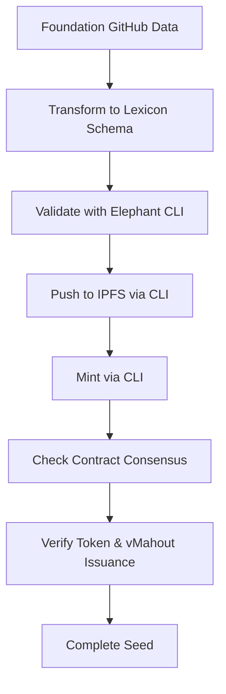

# Test Evaluator Agent

An AI-powered data extraction evaluator agent using LangGraph for property data processing.

## Features

- Multi-agent conversation system for data extraction validation
- Schema validation using JSON Schema
- CLI validation integration
- Address matching with fuzzy logic
- Retry mechanism with configurable limits
- IPFS schema fetching and caching

## Installation

you can run the tool to use the county base script using `--transform --group county` and provide the zip file using `--input-zip` :

```bash
uvx --from git+https://github.com/elephant-xyz/AI-Agent test-evaluator-agent --transform --input-zip path_to_your_zip_file.zip
````
to specify output zip file use `--output-zip` argument:
```bash
uvx --from git+https://github.com/elephant-xyz/AI-Agent test-evaluator-agent --transform --input-zip path_to_your_zip_file.zip --output-zip path_to_your_output_zip_file.zip
````

to run this tool to transform seed use `--transform  --group seed` argument:

```bash
uvx --from git+https://github.com/elephant-xyz/AI-Agent test-evaluator-agent --transform --group seed --input-csv seed.csv
````

## Commands:
- `--output-zip`: Specify the output ZIP file for transformed data.
- `--input-zip`: Specify the input ZIP file containing property data.
- `--transform`: Enable data transformation mode.
- `--group`: Specify the group type (e.g., `county`, `seed`) for processing.
- `--input-csv`: Provide a CSV file for seed processing.


## Usage
The agent requires specific directory structure and environment variables:


### pre-requisites 

```
# Create a ZIP file of your input directory
zip -r your-data.zip your-data/

input directory should contain the following files:
1- unnormalized_address.json class for the property generated while mining seed
2- property_seed.json class for the property generated while mining seed
3- County data needs to be transformed represented in json or html file


```


### Agent output:
    ZIP File contain the transformed data


### Environment Variables
- `MODEL_NAME`: AI model to use (default: gpt-4.1)
- `TEMPERATURE`: Model temperature (default: 0)

### Running the Agent

```bash
# Set environment variables
export MODEL_NAME=gpt-4.1
export TEMPERATURE=0
export OPENAI_API_KEY=your_openai_api_key_here

# Run the agent
test-evaluator-agent
```

## How It Works

1. **Owner Extraction Phase**: The agent generates extraction scripts based on input files and schemas and analyze the owner data to determine whether it is a valid person or company.
2. **Address Matching Phase**: Generator matches addresses with candidates, CLI Validator checks final output
3. **Utility/Structer/layout extraction Phase** Generator extract utility, structure and layout information.
4 **Data Extraction and validation Phase**: Generator creates extraction scripts, Schema and Data Evaluators validate output


## Development

This package is designed to be run as a standalone tool with all dependencies managed automatically.

## NOTE: in case of running the generated scripts by AI agent directly without using the AI agent, you need to run prepare_to_submit.py script to build relationships and have data ready for submission

## Running Consensus diff tool:
```
   python3 consensus_diff.py hash1 hash2 hash3
```

# Seeding Process

## Overview

The seeding process transforms property data into blockchain-verified assets through a structured workflow. The Foundation team provides initial data on GitHub, and developers complete the seeding process by transforming, validating, storing, and minting using the Elephant CLI.

## Seed Group Architecture

### Core Components

The **Seed Group** serves as the foundational structure consisting of four essential classes:

#### 1. Group Object
- Acts as the root of the Merkle document
- Provides the top-level container for all related data
- Gets hashed and referenced in the smart contract
- Forms the Merkle root for data integrity verification

#### 2. Relationship
- Defines connections and links between objects
- Establishes data relationships within the Seed Group
- Enables proper data association and referencing

#### 3. Property Seed
- Contains information needed to retrieve property details
- Interfaces with county systems via HTTP requests
- Uses parcel ID for property identification
- Enables access to official county records

#### 4. Unnormalized Address
- Raw address input as provided by data sources
- May not be normalized or geocoded initially
- Identifies property location for mapping services
- Compatible with services like Google Maps for location verification

## Foundation Data Provision

### GitHub Data Repository

The Foundation team provides initial property data through GitHub repositories, organized by county:

**Example**: [Palm Beach County Data](https://github.com/elephant-xyz/AI-Agent/tree/main/counties/palm%20beach)

### Data Structure
- County-organized folders containing property information
- Certified county data links and references
- Raw property data ready for transformation
- Documentation and metadata for each property

## Seeding Workflow

Developers complete the seeding process using the **[Elephant CLI](https://github.com/elephant-xyz/elephant-cli)** tool for all operations.

### Step-by-Step Process



#### Step 1: Access Foundation Data
- Navigate to the appropriate county folder on GitHub
- Example: [Palm Beach County](https://github.com/elephant-xyz/AI-Agent/tree/main/counties/palm%20beach)
- Download or clone the repository data
- Review property information and structure

#### Step 2: Transform to Lexicon Schema
- Convert Foundation data to **[Lexicon Schema](https://lexicon.elephant.xyz/)** format
- Ensure data structure compatibility with blockchain requirements
- Follow schema specifications for proper formatting
- Prepare data for validation step

#### Step 3: Validate Using Elephant CLI
- Install and configure **[Elephant CLI](https://github.com/elephant-xyz/elephant-cli)**
- Run validation commands to verify data integrity
- Ensure schema compliance and structure correctness
- Fix any validation errors before proceeding

#### Step 4: Push to IPFS
- Use Elephant CLI to upload validated data to IPFS
- Generate IPFS content hashes for decentralized storage
- Verify successful storage and accessibility
- Record IPFS hash for minting process

#### Step 5: Mint the Seed
- Execute minting command via Elephant CLI
- Generate and submit Merkle hash to smart contract
- Complete blockchain registration process
- Initiate consensus verification process

#### Step 6: Verify Contract Consensus & Token Issuance
- Check smart contract for consensus confirmation
- Verify that consensus has been reached by network validators
- Confirm token issuance has occurred
- Verify vMahout token distribution
- Validate final seed completion status


